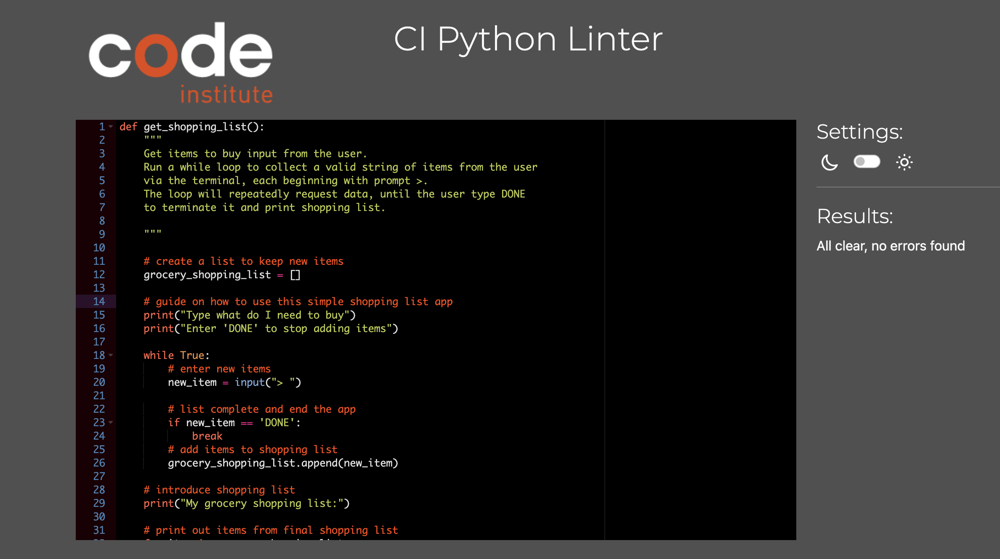

# Grocery Shopping List App

- Live project is available here https://grocery-shopping-list-40ff36c9c4cb.herokuapp.com/

    - In this project the app I created is very simple but includes several future enhancements I will explain in a later section.
    - The app is like a useful shopping assistant that ask you what do you need to buy, then you enter one by one each item until you enter "DONE" to stop adding things so the assistant gives you back the complete grocery shopping list.

# Features

- After the function description I added 2 print statements to guide the user on how to use this simple shopping list app.
- When you start the app an initial message asks you what do you need to buy, then you can start entering each item.
- To stop adding items and return a complete shopping list, simply type DONE.  

# Technologies 

- [PEP8:](http://pep8online.com/) Check your code for PEP8 requirements.

- [Heroku:](https://dashboard.heroku.com/) for deployment of the application.

- [Git](https://git-scm.com/): was used for version control by utilising the Gitpod terminal to commit to Git and Push to GitHub.

- [GitHub:](https://github.com/): is used as the respository for the projects code after being pushed from Git.

# Testing

- Checked code on https://pythontutor.com/visualize.html#mode=edit 
- Validator Testing : 

    - PEP8 Online linter (Python validator)
    - The code passed without any errors.
    - PEP8 online

- Testing has been carried out on the following browsers :
    - Chrome Version 126.0.6478.127 (Official Build) (arm64)
    - Firefox Version 126.0.1 (64 bit)
    - Safari on macOS Sonoma 14.5 (Safari Version 17.5)

- The app works as expected, starting with the initial query, then you can enter each item to buy and stop it typing DONE.
    After that the app return the complete shopping list.

# Future implementations

- The app will include the possibility to have a sort of validation to make sure the user did not forget anything to buy. 
    - This can be done with an additional query asking if you need to add any other item and that can start the loop again after typing yes or no.
    - If yes the user can continue adding item.
    - Also, some other validator can be added to give an error if entered numbers instead of valid strings.

# Deployment

- How this site was deployed

- In the GitHub repository, navigate to the Settings tab, then choose Pages from the left hand menu

- From the source section drop-down menu, select the Master Branch

- Once the master branch has been selected, the page will be automatically refreshed with a detailed ribbon display to indicate the successful deployment

- Any changes pushed to the master branch will take effect on the live project

# Heroku Deployment

The site was deployed to Heroku. The steps to deploy are as follows:
- Log in to Heroku.
- Click "Create new app".
- Choose app name and choose a region.
- Click "Create app".
- Navigate to the "settings" tab.
- Click "Reveal Config Vars".
- Add Config Var in Heroku's Settings. The key is PORT and the value is 8000
- Scroll down to "Buildpacks".
- Click "Add Buildpack".
- First add "python", click save.
- Second add "nodejs", click save.

# How to clone the repository

- Go to the https://github.com/Ale-DP/grocery-shopping-list/deployments/github-pages repository on GitHub
- Click the "Code" button to the right of the screen, click HTTPs and copy the link there
- Open a GitBash terminal and navigate to the directory where you want to locate the clone
- On the command line, type "git clone" then paste in the copied url and press the Enter key to begin the clone process

